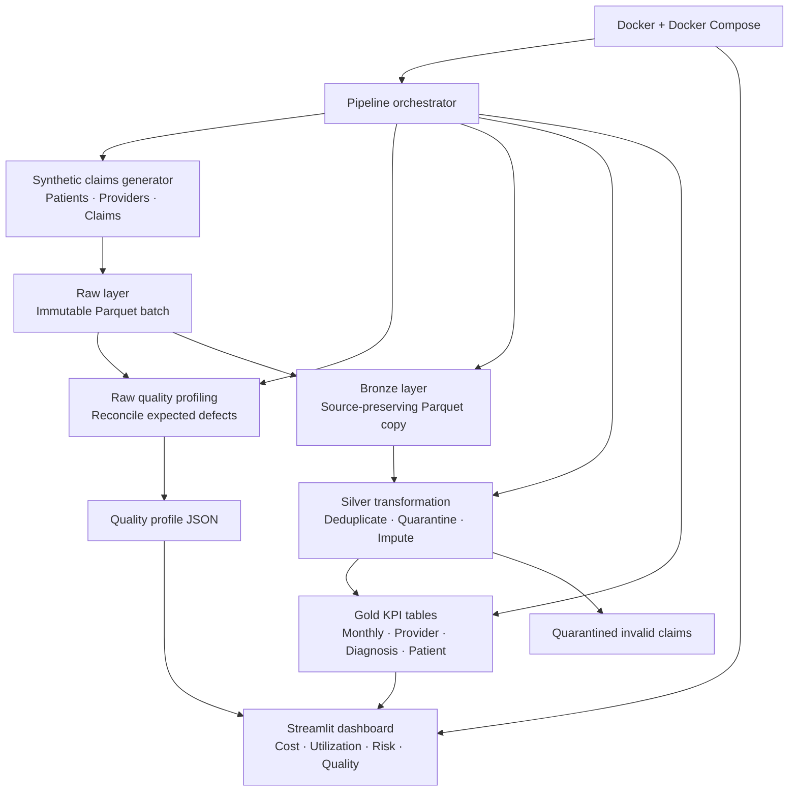

# Current Architecture — Healthcare Claims Lakehouse

> This implementation uses synthetic Medicare-style claims only. No real patient data or PHI is used.

## Components

| Layer / component | Purpose |
|---|---|
| Synthetic generator | Creates reproducible patients, providers, and Medicare-style claims with deliberate data-quality defects. |
| Raw | Preserves each batch exactly as received in Parquet format. |
| Quality profiling | Detects missing diagnoses, negative payments, invalid discharge dates, duplicates, and invalid references before transformation. |
| Bronze | Creates a traceable, source-preserving copy of Raw data. No values are changed, removed, or deduplicated. |
| Silver | Removes duplicate claims, quarantines invalid records, validates references, and imputes missing diagnosis information when safe. |
| Gold | Publishes analytics-ready monthly, provider, diagnosis, and patient utilization KPI tables. |
| Streamlit dashboard | Lets users explore cost trends, providers, diagnoses, high-cost patients, and data-quality results. |
| Docker + Compose | Ensures the tests, pipeline, and dashboard run consistently on another machine. |

## Verified pipeline outcome

For the `orchestration_demo_001` synthetic batch:

| Measure | Verified result |
|---|---:|
| Raw claims received | 10,100 |
| Duplicate claims removed | 100 |
| Invalid claims quarantined | 150 |
| Missing diagnoses imputed | 147 |
| Silver claims published | 9,850 |
| Gold monthly KPI rows | 25 |
| Synthetic total paid amount | $26,027,054.22 |

## Engineering controls

- Reproducible synthetic-data generation through a fixed random seed.
- Raw-to-Bronze data preservation for auditability.
- Quality-gate reconciliation against intentionally injected defects.
- Quarantine of unsafe records rather than silently changing them.
- Automated regression tests with `pytest`.
- Containerized testing and dashboard execution with Docker Compose.
- Version-controlled source code and documentation in GitHub.