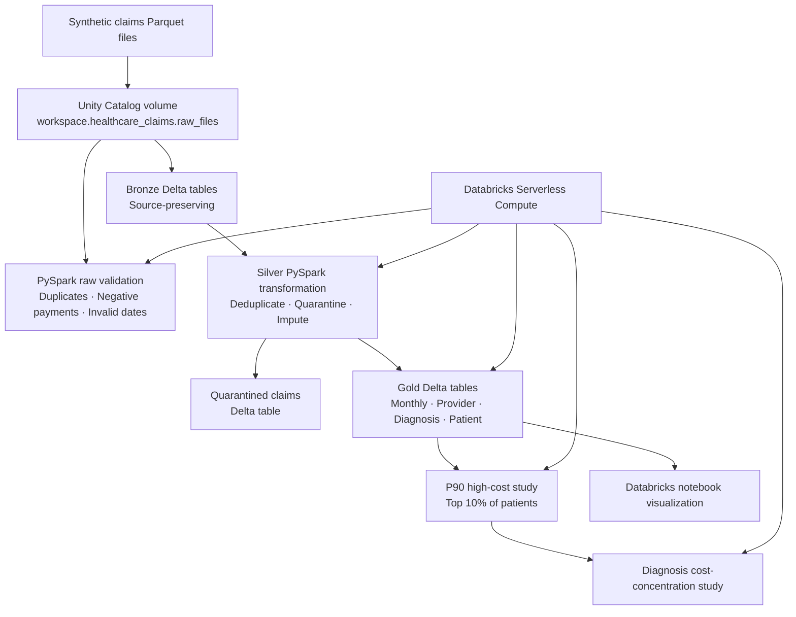

# Databricks Architecture — Healthcare Claims Lakehouse

> This implementation uses Databricks Free Edition, Unity Catalog managed storage, PySpark, and Delta Lake. It uses synthetic Medicare-style data only—no AWS account, S3 bucket, real patient data, or PHI.

## Databricks objects

| Object | Name |
|---|---|
| Catalog | `workspace` |
| Schema | `healthcare_claims` |
| Raw-data volume | `workspace.healthcare_claims.raw_files` |
| Bronze tables | `bronze_patients`, `bronze_providers`, `bronze_claims` |
| Silver tables | `silver_patients`, `silver_providers`, `silver_claims`, `quarantined_claims` |
| Gold KPI tables | `gold_monthly_cost_utilization`, `gold_provider_performance`, `gold_diagnosis_cost_utilization`, `gold_patient_utilization` |
| M06 study tables | `gold_high_cost_utilization_study`, `gold_high_cost_diagnosis_drivers` |

## Verified Databricks outcomes

| Measure | Result |
|---|---:|
| Raw claims loaded | 10,100 |
| Duplicate claims removed | 100 |
| Invalid claims quarantined | 150 |
| Silver claims published | 9,850 |
| Gold monthly KPI rows | 25 |
| Synthetic total paid amount | $26,027,054.22 |
| High-cost rule | P90 — top 10% by total paid amount |
| High-cost threshold | $52,856.86 |
| High-cost cohort | 100 patients, 25.3% of synthetic paid cost |

## Design decisions

- Used Databricks-managed Unity Catalog storage instead of AWS S3 to keep the implementation cost-free.
- Wrote Bronze, Silver, quarantine, Gold, and study outputs as Delta tables.
- Kept the local Docker/Streamlit implementation separate, allowing the cloud PySpark implementation to be verified independently.
- Treated diagnosis results as synthetic exploratory cost concentration, not clinical causation.